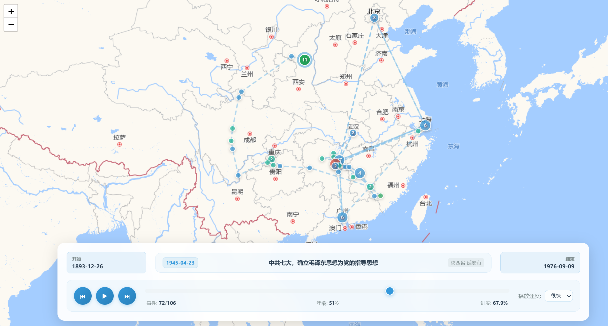

<div align="center">

# 📍 跟着教员走遍中国 - 毛主席足迹地图

[](https://github.com/sansan0/mao-map/stargazers)
[](https://github.com/sansan0/mao-map/network/members)
[](LICENSE)

[](#)
[](#)
[](https://sansan0.github.io/mao-map)

</div>

> 读万卷书，行万里路

本项目通过数据可视化的力量，将毛泽东主席自 1893 年至 1976 年波澜壮阔的一生，浓缩于一张可交互的动态地图之上。让那段恢弘的历史"活"起来，清晰、生动地展现伟人在中国历史洪流中的每一个关键抉择与地理印记。

让我们共同追随伟人的脚步，触摸那段改变中国命运的历史脉搏。

**在线体验：[https://sansan0.github.io/mao-map/](https://sansan0.github.io/mao-map/)**

<p align="center">
  
</p>

## 🎯 地图功能一览

### 探索功能

- **动态播放**：点击 ▶️ 播放按钮，可以按时间顺序观看毛主席一生的足迹动画。
- **查看详情**：点击地图上的任何一个标记，可以了解该地点发生的具体历史事件。
- **时间定位**：拖动底部的时间轴，可以快速定位到特定年份，查看当时的活动。
- **多端支持**：项目同时支持电脑和手机浏览器，方便随时查看。

### 控制与交互

- **播放/暂停**：按时间顺序自动播放历史事件。
- **速度调节**：调整自动播放的速度。
- **前进/后退**：手动切换到上一个或下一个事件。
- **事件信息窗口**：点击标记可查看事件描述、主席年龄、到访次数等。

### PC 端快捷键

- **空格键**：播放 / 暂停
- **← / →**：前一个 / 后一个事件
- **Home / End**：瞬间跳转至起点 / 终点

## 🚀 立即体验

### 方式一：在线访问 (推荐)

直接点击链接即可：[https://sansan0.github.io/mao-map/](https://sansan0.github.io/mao-map/)

_（若访问速度慢或失败，可尝试下面的本地运行方法）_

### 方式二：在自己电脑上运行

如果你想在本地稳定运行或进行二次开发，请按以下步骤操作。

1.  **克隆或下载项目**

    ```bash
    # 使用 Git 克隆
    git clone https://github.com/sansan0/mao-map.git
    cd mao-map

    # 或者，直接下载并解压 ZIP 包
    # https://github.com/sansan0/mao-map/archive/refs/heads/master.zip
    ```

2.  **启动本地服务器**
    - **方法 A：使用 Python** (需已安装 Python)
      ```bash
      # 在项目根目录运行
      python -m http.server 8000
      # 然后在浏览器访问 http://localhost:8000
      ```
    - **方法 B：使用 VS Code & Live Server 插件**
      1.  安装代码编辑器 [VS Code](https://code.visualstudio.com/)。
      2.  在 VS Code 插件市场安装 [Live Server](https://marketplace.visualstudio.com/items?itemName=ritwickdey.LiveServer)。
      3.  在 VS Code 中打开项目文件夹。
      4.  在 `index.html` 文件上右键，选择 `Open with Live Server`。

## 💖 邀你共绘历史画卷

这个项目不只是代码，更是一项开放的集体事业。我深信"群众的眼睛是雪亮的"，一个严谨、准确、全面的历史数据库，需要依靠每一位热爱历史的朋友共同创建。

无论你是发现了一个错误日期，还是想补充一段被遗漏的足迹，你的每一次贡献，都在让这张历史画卷更加完整、生动。

### 贡献方式

为了让大家更方便地提交准确的校订建议，我在地图中内置了一个小工具：

**使用方法**：

1. 打开 [在线地图](https://sansan0.github.io/mao-map/)
2. 拖动底部时间轴到你想要校订或引用的事件位置
3. **双击时间轴滑块**，即可自动复制该事件的完整 JSON 数据到剪贴板
4. 直接粘贴到 GitHub Issues 中，作为你反馈的参考依据，根据这个来对照自己要填写修改的内容

**复制的数据格式示例**：

```json
    {
      "date": "1914-03",
      "age": 20,
      "movementType": "原地活动",
      "event": "转入湖南省立第一师范学校",
      "coordinates": {
        "start": {
          "province": "湖南省",
          "city": "长沙市"
        },
        "end": {
          "province": "湖南省",
          "city": "长沙市"
        }
      },
      "verification": "",
      "userVerification": []
    },
```

#### 方式一：提交"信息卡片" (无需编程，推荐)

发现错误或想补充事件？只需填写我们准备好的模板，然后通过 GitHub Issues 提交。

1.  **选择模板**：根据你的目的，复制下面的"校订"或"增补"模板。

    <details>
    <summary>✍️ 点击展开：校订现有事件模板</summary>

    ```markdown
    ## 修改现有事件

    **事件发生的年份/日期**: 1921-07-23 <!-- 请填写你要修改的事件的日期，方便定位 -->
    **问题类型**: □ 日期错误 ☑ 地点错误 ☑ 事件描述错误 □ 史料来源错误

    **原始数据 (你看到的错误信息)**:

    - 日期：1921 年 7 月
    - 地点：上海
    - 描述：参加中共一大

    **建议修改为**:

    - 日期：1921 年 7 月 23 日
    - 地点：上海法租界望志路 106 号（今兴业路 76 号）
    - 描述：出席中国共产党第一次全国代表大会开幕会议。

    **史料依据 (最重要！)**:
    《毛泽东年谱（1893-1949）》上卷，中央文献出版社，2013 年 12 月第 2 版，第 86 页。
    （强烈建议附上史料的截图或照片）
    ```

    </details>

    <details>
    <summary>➕ 点击展开：增补缺失事件模板</summary>

    ```markdown
    ## 新增历史事件

    - **日期**: 1927-09-09
    - **地点**: 湖南省浏阳市
    - **事件简述**: 领导湘赣边界秋收起义
    - **重要性级别**: 🔴 一级事件
    - **事件类型**: 长途移动 <!-- 请从 [出生, 国际移动, 长途移动, 短途移动, 原地活动] 中选一个 -->

    **详细描述**:
    毛泽东作为中共中央特派员和前敌委员会书记，在浏阳、文家市等地领导和发动了湘赣边界的秋收起义。这是我党第一次在武装斗争中公开打出自己的旗号——工农革命军。

    **史料依据 (最重要！)**:
    《毛泽东传》金冲及主编，中央文献出版社，2016 年修订版，第 150-155 页。

    **录入标准自查**:

    - [x] 涉及明确的地理移动
    - [x] 具有高度的历史重要性
    - [x] 史料来源可供查证

    **你的补充说明或感言 (选填)**:
    秋收起义是探索"农村包围城市"道路的伟大开端。
    ```

    </details>

2.  **提交卡片**
    1.  访问项目的 **[Issues 页面](https://github.com/sansan0/mao-map/issues)**。
    2.  点击绿色的 `New issue` 按钮。
    3.  **标题**清晰明了，如"修正 1921 年一大地点"或"补充 1927 年秋收起义"。
    4.  **内容**部分粘贴并填写好的信息卡片。
    5.  点击 `Submit new issue` 即可。

#### 方式二：直接编辑数据文件 (适合有技术背景的朋友)

如果你熟悉 JSON 和 Git，欢迎直接修改数据文件并发起 Pull Request。

1.  所有事件数据都存放在 `data/mao_trajectory_events.json`。
2.  **核心技巧：模仿！** 找到合适位置，复制一条现有记录，然后修改内容。
3.  **注意格式**：确保 JSON 格式正确，特别是**逗号**的使用（对象最后一个键值对后不加逗号，数组最后一个元素后不加逗号）。
4.  提交 Pull Request。

## 📝 贡献指南与数据规范

为保证项目质量，所有贡献都应遵循以下标准。

### 事件录入原则 (重要性分级)

我们依据事件的历史意义将其分为三级，这决定了事件在历史叙事中的权重。

- **🔴 一级 (历史主干)**：构成生平与中国历史**叙事主线**的**里程碑式转折点**。如：出生、参加中共一大、遵义会议、建立新中国等。
- **🟡 二级 (关键枝干)**：对主线起到**承上启下、重要铺垫**作用的事件。如：发表《湖南农民运动考察报告》、指挥四渡赤水、寻乌调查等。
- **⚪ 三级 (枝叶细节)**：丰富历史细节的**常规性、补充性**事件。如：在延安从杨家岭搬到枣园、常规性会议、短期休养等。

<details>
<summary>点击查看详细的分级标准与判断依据</summary>

#### 🔴 **一级事件 (必录) - 构成历史主干的转折点**

- **人生阶段的根本性转变：** 从韶山到东山学堂（首次离开家乡求学）、确立马克思主义信仰等。
- **革命和国家叙事的关键节点：** 领导秋收起义、抵达井冈山、到达延安、发表"论十大关系"等。
- **核心职务的标志性变动：** 当选中华苏维埃共和国主席、在遵义会议上被确立为军事领导核心、当选中华人民共和国主席等。
- **产生深远国际影响的活动：** 首次访问苏联、与尼克松会面等。

#### 🟡 **二级事件 (选录) - 承上启下的关键节点**

- **重要的思想理论形成与发表：** 在延安文艺座谈会上的讲话、发表《论持久战》、提出"百花齐放、百家争鸣"等。
- **重要的战役指挥与战略部署：** 部署三大战役的具体指挥、决策抗美援朝等。
- **重要的调查研究与地方视察：** 建国后首次视察黄河、南下视察等。
- **对个人和家庭有重大影响的事件：** 与杨开慧结婚；长子毛岸英牺牲等。

#### ⚪ **三级事件 (可选) - 丰富历史细节的日常活动**

- **常规性工作移动：** 建国后在多个住所（如中南海、北戴河、武汉东湖）之间的季节性移动。
- **一般性会议和接见：** 主持某次不产生重大路线变动的政治局常规会议、接见外国普通友好代表团等。
- **短期的休养或个人活动：** 在杭州进行短期休养、在北戴河游泳等。

</details>

### 数据字段详解 (JSON 格式)

每一条事件都遵循统一的 JSON 结构，确保数据的一致性。

查看完整数据文件：[mao_trajectory_events.json](https://raw.githubusercontent.com/sansan0/mao-map/master/data/mao_trajectory_events.json)

```json
{
  "date": "1893-12-26", // 事件发生日期
  "age": 0, // 主席当时年龄
  "movementType": "出生",
  "event": "毛泽东出生，字咏芝（后改润之），乳名\"石三伢子\"",
  "coordinates": {
    "start": null,
    "end": {
      "province": "湖南省",
      "city": "湘潭市",
      "district": "韶山市"
    },
    "transit": [] // 途径地点 (可选)
  },
  "verification": "《毛泽东年谱》，中央文献出版社，2002年版，第 1 页", // 史料来源。这是我后续增补的字段，这也是最需要你帮助的地方！
  "userVerification": [
    // 支持多人协同考据
    {
      "username": "湘江史话", // 考据者署名 (可选)
      "comment": "一个注定将改变中华民族命运的伟人在韶山冲的农家小院中诞生。此时的中国正值内忧外患，列强瓜分，民族危亡之际。这个婴儿的啼哭声，仿佛是历史的回响，预示着一个新时代的到来。从韶山走向天安门，从农家子弟到开国领袖，毛泽东的一生将与中国人民的解放事业紧密相连，书写出波澜壮阔的历史篇章。", // 考据补充或感言 (可选)
      "date": "2025-06-30" // 考据日期 (可选)
    }
  ]
}
```

#### `movementType`: 事件性质分类标准

为了确保地图标记的准确性和一致性，请严格按照以下标准选择事件类型：

- **`"出生"`**：仅用于毛主席的出生事件

  - 要求：`start` 必须为 `null`，`end` 必须有值，不能有 `transit`

- **`"国际移动"`**：跨越国界的移动

  - 要求：`start` 和 `end` 必须在不同国家，可以有 `transit`
  - 判断标准：整个行程（包括途径点）涉及至少两个国家

- **`"长途移动"`**：跨越省份的移动

  - 要求：`start` 和 `end` 必须在不同省份，可以有 `transit`
  - 判断标准：整个行程（包括途径点）涉及多个省份

- **`"短途移动"`**：省内不同地区间的移动

  - 要求：主要活动区域在同一省份内，可以有 `transit`
  - 判断标准：虽然可能涉及邻省，但主要活动在同一省份

- **`"原地活动"`**：在固定地点的活动，无地理位移
  - 要求：`start` 和 `end` 必须完全相同，不能有 `transit`
  - 判断标准：活动地点没有发生变化

#### `coordinates`: 地理坐标的规范填写

地图连线遵循 **"终点到终点"** 的原则：从前一个事件的 `end` 连接到当前事件的 `end`(也就是说，当前事件的 `start` 默认是上一个事件的 `end`)，途径点作为路径的中间节点。

1. **`start`（起点）**：

   - 出生事件：必须为 `null`
   - 其他事件：事件开始时所在的地点
   - 原地活动：必须与 `end` 相同

2. **`end`（终点）**：

   - 所有事件都必须有 `end` 坐标
   - 这是地图上标记显示的位置
   - 也是连线的目标点

3. **`transit`（途径点）**：
   - 仅在行程中有重要停留时填写
   - 按照时间顺序排列
   - 会在地图上显示为路径的中间节点

**地理精度要求：**

- 优先精确到区/县级：`"district": "韶山市"`
- 其次精确到市级：`"city": "湘潭市"`
- 最后精确到省级：`"province": "湖南省"`
- 国外地点：`"country": "俄罗斯", "city": "莫斯科"`

#### `event`: 事件描述

- **怎么填**: 用一句话简明扼要地描述发生了什么事。这是事件的核心内容。
- **举例**: `"考察湘潭、湘乡、衡山、醴陵、长沙五县农民运动，历时32天"`

#### `verification`: 史料出处

- **怎么填**: **这是项目最看重的部分！** 请务必写清楚你这条信息的来源，方便大家核对。
- **格式**: 最好是 `书名，出版社，出版年份，第几页`。
- **举例**: `"《毛泽东年谱（1893-1949）》上卷，中央文献出版社，2013年版，第1页"`

#### `userVerification`: 考据与感言

- **怎么填**: 这是一个可以自由发挥的地方。你可以：
- 写下你对这个事件的补充说明或研究心得。
- 分享你查证过程中的故事。
- 抒发你对这段历史的感想。
- 最后可以留下你的大名和日期，作为贡献纪念！

## 📞 交流与联系

- **提交贡献/BUG**：请统一通过 [GitHub Issues](https://github.com/sansan0/mao-map/issues) 提交，这是追踪和处理问题最高效的方式。
- **交流与讨论**：欢迎关注公众号 **【硅基茶水间】**，分享你的想法。


## 🌟 项目愿景

我希望，通过这个开源项目：

- **点亮** 沉睡在故纸堆中的史料，将抽象的文字转化为生动的时空叙事。
- **连接** 过去与未来，让今天的我们能更直观地理解历史的经纬。
- **汇聚** 个体的力量，用集体的智慧共建一个开放、严谨、鲜活的红色历史知识库。

> **"古为今用"**，希望这个工具能成为大家学习历史、理解历史的得力助手。

## 📄 开源协议

本项目采用 [GPL-3.0 License](LICENSE) 协议开源，欢迎一切形式的分享与二次创作。
